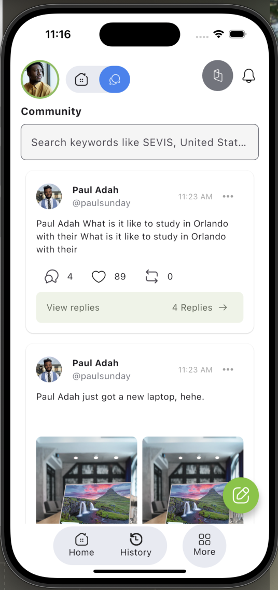
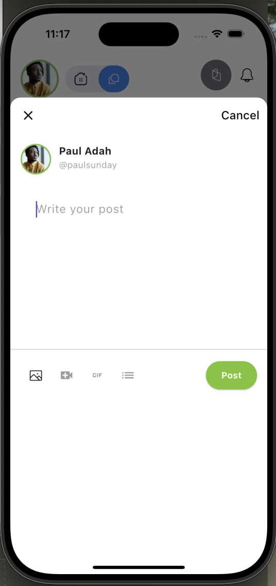
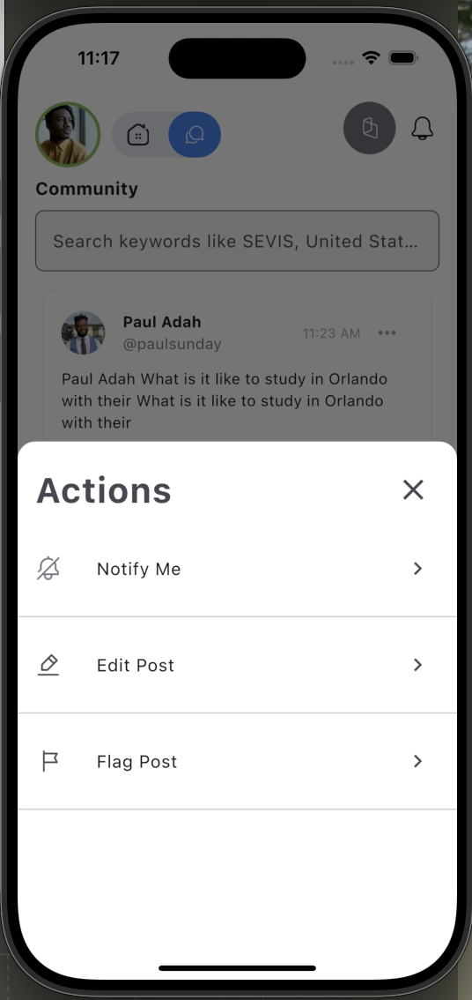
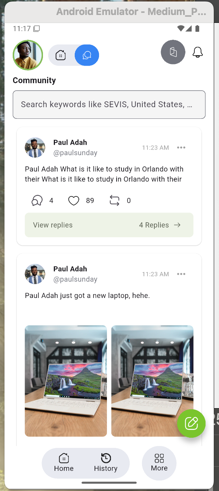
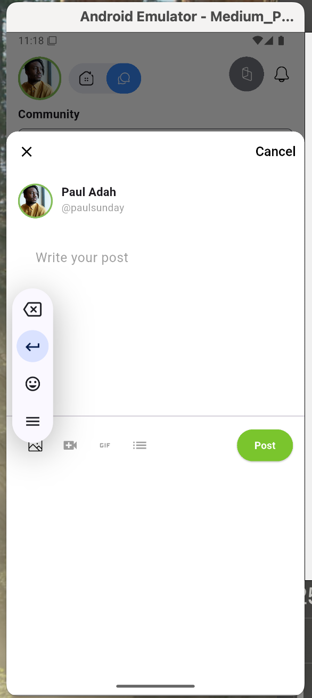
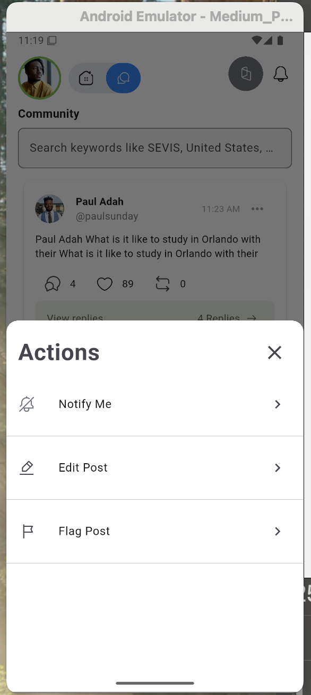
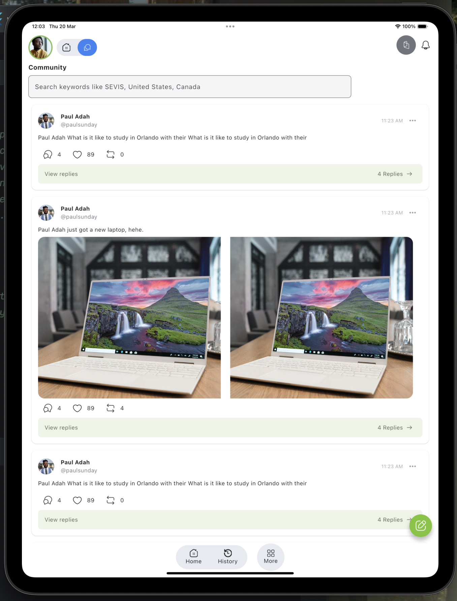
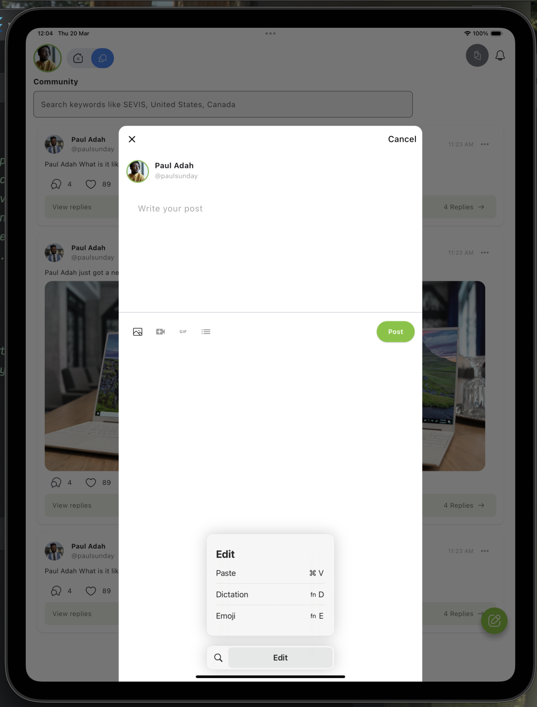
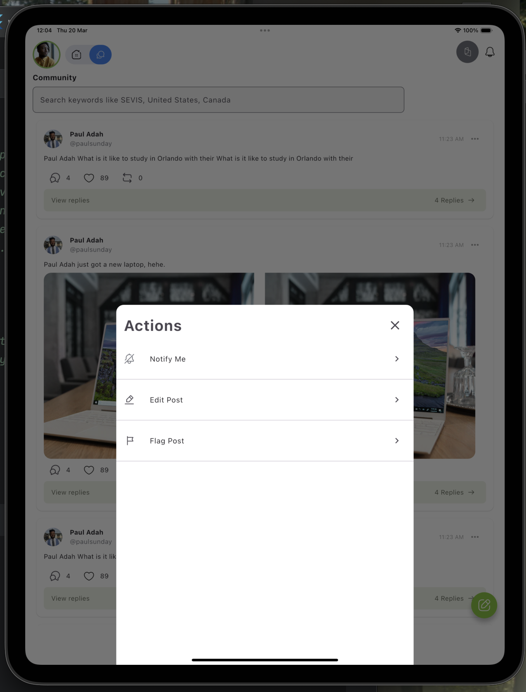

# Pay4Me

This Flutter application is a social media-like platform that allows users to view posts, like them, comment, and create new posts. It also includes search functionality and a bottom navigation bar.

## Table of Contents

- [Setup Instructions](#setup-instructions)
- [Architecture Decisions](#architecture-decisions)
- [Features](#features)
- [Dependencies](#dependencies)
- [Testing](#testing)

## Setup Instructions

1.  **Clone the repository:**

    ```bash
    git clone https://github.com/ayosol/Pay4Me.git
    cd Pay4Me
    ```

2.  **Install dependencies:**

    ```bash
    flutter pub get
    ```

3.  **Run the app:**

    ```bash
    flutter run
    ```

## Architecture Decisions

* **Architecture:**
    * Considering the application's size and complexity, the application follows a simple architecture that separates concerns into distinct layers.
    * The application uses a single screen (`HomeScreen`) to display the post feed, search bar, and bottom navigation bar.
    * The application uses a modular structure, separating UI components, state management, and data models into distinct folders.
    * Although the application is small, it is designed to be scalable and maintainable with the MVVM style in the long run.
  
* **State Management:**
    * The application uses `flutter_riverpod` for state management. This choice was made for its simplicity, performance, and ease of testing. Riverpod allows for efficient state sharing and management across the application.
    * `StateNotifierProvider` is used to manage the list of posts, enabling efficient state updates. 
    * `StateProvider` is used for simple states like search queries and results.
* **UI Architecture:**
    * The UI is structured using Flutter's widget tree. Custom widgets like `PostWidget`, `SearchBarWidget`, and `TopNavBar` are created to encapsulate specific UI components.
    * The application follows a modular structure, separating UI components, state management, and data models into distinct folders.
* **Folder Structure:**
    * `lib/main.dart`: Entry point of the application.
    * `lib/core/theme`: Contains theme-related files (`app_colors.dart`, `theme.dart`).
    * `lib/models`: Contains data models (`post.dart`).
    * `lib/providers`: Contains Riverpod providers (`post_provider.dart`).
    * `lib/ui/screens`: Contains screen widgets (`homescreen.dart`).
    * `lib/ui/widgets`: Contains reusable UI widgets (`bottom_nav.dart`, `create_post_fab.dart`, `create_post_sheet.dart`, `post_widget.dart`, `search_bar.dart`, `top_nav_bar.dart`).
    * `test`: Contains widget tests.
* **Testing strategy:**
    * Widget tests are implemented to verify the functionality of individual widgets, such as `PostWidget`, `SearchBarWidget`, and `HomeScreen`. Tests are written to cover user interactions, state changes, and UI rendering.

## Features

* Displaying a list of posts with user details, content, and media.
* Liking and unliking posts.
* Viewing comments and reposts.
* Creating new posts via a bottom sheet.
* Searching for users using a search bar.
* Bottom navigation bar for navigating between screens.
* Top navigation bar with user profile, navigation icons, and notification and wallet icons.
* Displaying advertisements within the post feed.
* A modal bottom sheet that displays post actions.

## Dependencies

* `flutter_riverpod`: State management.
* `flutter_test`: Widget testing.

## Testing

To run the tests:

```bash
flutter test# pay4metask
```

## Screenshots

**iPhone 16 Pro:**




**Android Pixel:**




**iPad Pro:**





